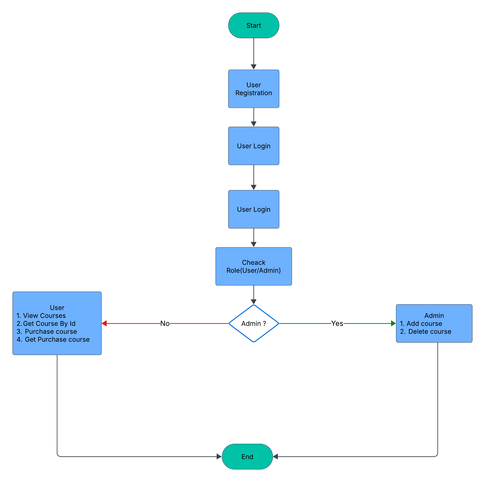

# Course Management API 

## Overview
Node.js + Express + MongoDB API to register/login users, manage courses (admin), and purchase courses.

## Features
- JWT authentication (access + refresh tokens)
- Roles: `user` and `admin`
- Admin endpoints to create/delete courses
- Users can browse and purchase courses
- Centralized error handling and input validation (express-validator)
- Passwords hashed with bcrypt

## Setup
### 1. Clone repo
```sh
$ git clone https://github.com/Rakibul599/Course-Management-API.git
$ cd Course-Management-API

```
### 2. Install Dependencies

```sh
$ npm install
```
### 3. Copy `.env.example` to `.env` and fill values
```sh
$ cp .env.example .env
```
### 4. Start MongoDB locally (or use hosted DB) and set `MONGOOSE_CONNECTION_STRING`
### 5. Run Command 
```sh
$ npm start
```


## Environment variables
See `.env.example`.

## API Endpoints (summary)
- `POST /register` - register
- `POST /login` - login (returns `accessToken`, `refreshToken`)
- `POST /refresh` - refresh tokens
- `POST /logout` - logout (invalidate refresh token)
- `POST /course/addcourse` - create course (admin)
- `GET /course/getallcourse` - list courses
- `GET /course/getcoursebyid?id=your course id` - course detail
- `DELETE /course/deletecoursebyid?id=your course id` - delete course (admin)
- `POST /purchase/purchasescourse` - purchase course (authenticated)
- `GET /purchase/mycourse` - get current user's purchases

## Postman
Import `postman_collection.json`. Set `baseUrl` variable to `http://localhost:3000`.

## Flowchart

